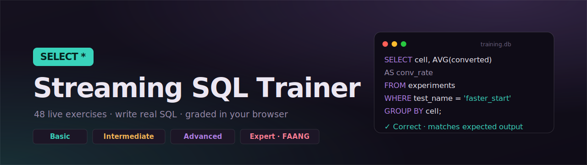

# Streaming SQL Trainer

A live, in-browser SQL learning environment where you write real queries against a streaming-analytics database and have them graded automatically. Every exercise is modeled on the kind of work analysts actually do at media and streaming companies: subscriber retention, content engagement, A/B testing, and cross-platform reporting.

No backend, no signup, no install. A full SQLite engine runs in the browser through WebAssembly, so when you press **Run**, your SQL executes against a real database, and when you press **Check**, your answer is graded by comparing result sets (any correct phrasing passes, not just one exact string).

[](https://YOUR-USERNAME.github.io/streaming-sql-trainer/)
&nbsp;


> **Live demo:** https://YOUR-USERNAME.github.io/streaming-sql-trainer/

---

## Why I built this

I am a senior analyst with roughly seven years in financial reporting and contract administration across major entertainment companies, now moving into data analytics with a focus on media, streaming, and content performance. Rather than grind anonymous practice problems, I built the practice tool I wanted: one that runs real SQL, grades it fairly, and frames every concept in the language of the industry I am targeting. The result doubles as a portfolio piece that shows three things at once: SQL depth across all four difficulty tiers, front-end engineering (a self-contained app with an embedded database), and domain fluency in entertainment analytics.

## What it does

- **48 hands-on exercises** across four progressive tiers, from `SELECT` to correlated subqueries and window frames.
- **A real database in the browser.** SQLite is compiled to WebAssembly and seeded with five themed tables. Your queries genuinely execute; there is no mocking.
- **Fair auto-grading.** Answers are checked by comparing the returned result set against the canonical solution, so different valid approaches all pass. Order-sensitive lessons (anything with `ORDER BY` or a running calculation) are graded in sequence.
- **Real SQLite error messages** surface in the console, so you learn to read and fix them.
- **Dialect awareness.** Where the target warehouse syntax differs (`QUALIFY`, `DATEDIFF`, `PERCENTILE_CONT`, `FILTER` vs `CASE`), the lesson flags it, so the concepts transfer to Snowflake and BigQuery even though the engine is SQLite.
- **Zero install for the learner.** Open the link on any phone or laptop with an internet connection.

## Curriculum

**Basic (9 lessons).** SELECT, DISTINCT, WHERE, AND/OR/NOT, BETWEEN, IN, LIKE, a filtering review, and ORDER BY.

**Intermediate (12 lessons).** Aggregates (SUM/AVG/COUNT), GROUP BY, HAVING, COUNT DISTINCT, arithmetic, math functions, integer division, NULL handling with COALESCE, CASE expressions, INNER JOIN, and date functions.

**Advanced (12 lessons).** Subqueries, CTE vs subquery, aggregate window functions, RANK / DENSE_RANK / ROW_NUMBER, LEAD / LAG, self-joins, UNION / INTERSECT / EXCEPT, clean-SQL refactoring, query execution order, pivoting, string functions, and an analytics case study.

**Expert · FAANG (15 lessons).** Correlated subqueries, EXISTS / NOT EXISTS anti-joins, running totals and moving averages with window frames, top-N-per-group (with the QUALIFY pattern), NTILE and percentiles, conditional aggregation with FILTER, gaps-and-islands streak detection, cohort retention, A/B test analysis, date arithmetic and tenure, recursive CTEs, deduplication to the latest record, a multi-window engagement-leaderboard capstone, and a no-scaffolding cohort-churn interview prompt.

## Data model

The trainer ships with five seeded tables that mirror a media conglomerate's analytics warehouse:

| Table | Grain | Purpose |
|---|---|---|
| `titles` | one row per title | catalog metadata (type, genre, rating, score, views) |
| `plays` | one row per session | playback events linked to titles |
| `members` | one row per subscriber | subscription lifecycle across Netflix, Disney+, Spotify, Max, Xbox |
| `streams` | one row per engagement event | cross-medium consumption (series, film, music, games) |
| `experiments` | one row per A/B assignment | control vs treatment, conversion, and a quality-of-experience metric |

## Grounded in real industry problems

The Expert tier is built from patterns that entertainment-analytics teams publish about and interview on:

- **A/B testing** modeled on a real experimentation workflow: members assigned to control or treatment cells, measured on conversion and on a **play-delay** quality metric (the milliseconds between pressing play and playback starting). The seeded data shows treatment cutting play delay while lifting conversion, the exact read an analyst delivers.
- **Cohort retention and churn**, the core of every subscription dashboard, computed from signup month and cancellation date.
- **Gaps and islands** for consecutive-day engagement streaks, the classic hard window-function question.
- **Running totals, moving averages, and concentration analysis** over a daily engagement series.
- **Cross-medium and cross-company reporting** so the patterns generalize from streaming video to music, games, and home entertainment.

## How it works

The entire application is a single self-contained HTML file with vanilla JavaScript and no framework. On load it pulls [sql.js](https://sql.js.org/) (SQLite compiled to WebAssembly) from a public CDN, builds an in-memory database from a seed script, and renders the lessons. Grading runs the user's query and the canonical solution against the same database and compares the result sets in JavaScript. There is no server, no tracking, and no stored state, which keeps it trivial to host and instant to open.

## Tech stack

`SQL (SQLite)` · `JavaScript (ES6, no framework)` · `sql.js / WebAssembly` · `HTML5 / CSS3` · `GitHub Pages`

## Run locally

Because it is one static file, you can simply open `index.html` in any modern browser. For a local server:

```bash
# Python 3
python3 -m http.server 8000
# then open http://localhost:8000
```

An internet connection is required the first time you open it, so the browser can fetch the SQLite engine from the CDN.

## Roadmap

- Optional progress persistence (currently a refresh resets, by design, for clean repeat drilling).
- A parallel Postgres and Snowflake answer key for the same 15 expert problems, in native `QUALIFY` / `DATE_PART` / `PERCENTILE_CONT` dialect.
- Additional tiers for analytics-engineering patterns (incremental models, slowly changing dimensions).

## About the author

**Shamar** — senior analyst transitioning into data analytics for media, streaming, and entertainment. Background in financial reporting and contract administration at Warner Bros. Discovery, Disney, and Legendary Entertainment, plus an MBA in arts, entertainment, and media management. Targeting data analyst and reporting analyst roles focused on content performance, subscriber and revenue analytics, and production finance.

- LinkedIn: `[add your LinkedIn URL]`
- Portfolio / contact: `[add your link]`

## License

Released under the MIT License. See [LICENSE](LICENSE).
